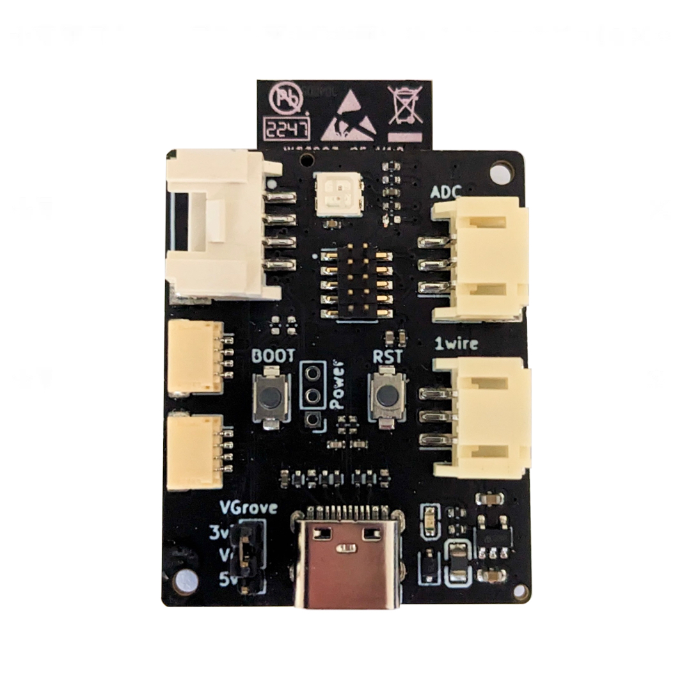

# Dialedin Products
Explore in-depth information and additional resources available for the complete Dialedin product range.  

### OpenSense Module
A compact breakout board meticulously crafted to provide the perfect foundation for creating sensor-based modules using open automation platforms like Tasmota, ESPHome or ESPEasy. Its compact design ensures stability and reliability, setting it apart from other development kits on the market.  
[DI-OSM1 Product details](openSense/README.md)

    

### SHT40 Temperature Sensor
A precision SHT40 temperature and humidity sensor, ready to plug right into the OpenSense module or any other StemmaQT or QWIIC setup.  
[SHT4x Product details](sht4x_sensor/README.md)

    

