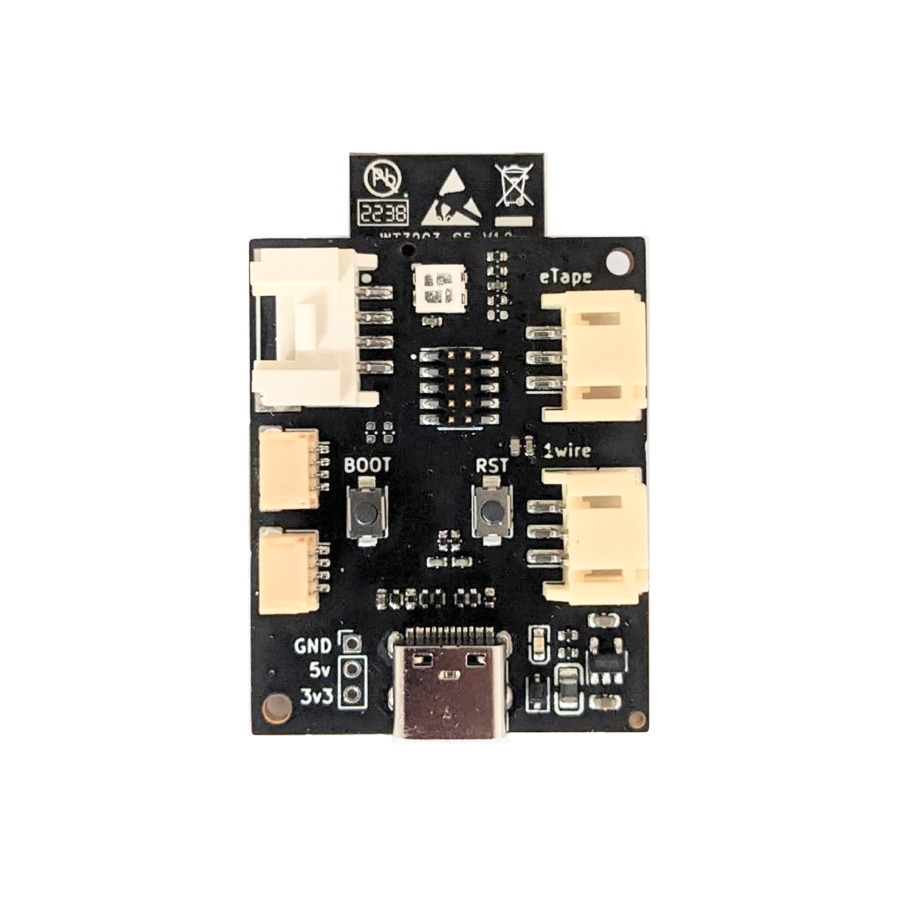
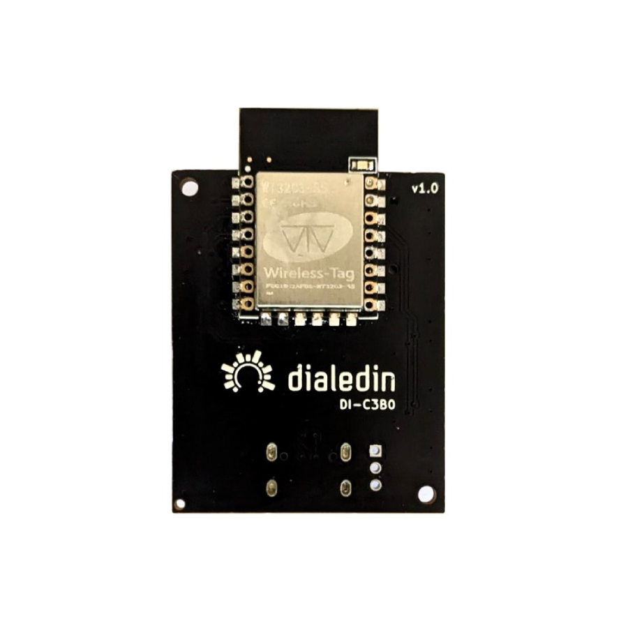
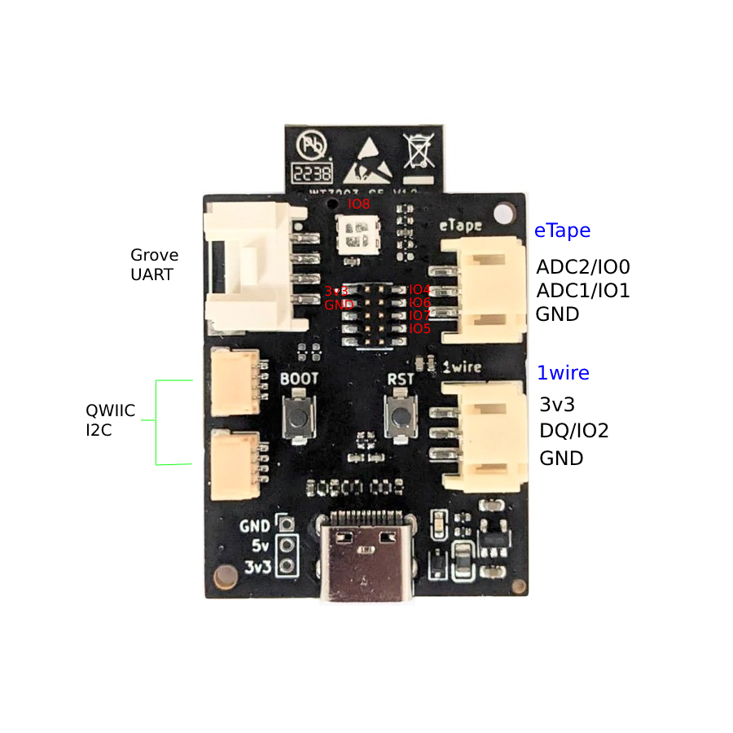

# Open Sense Module

A compact breakout board meticulously crafted to provide the perfect foundation for creating sensor-based modules using open automation platforms like Tasmota, ESPHome or ESPEasy. Its compact design ensures stability and reliability, setting it apart from other development kits on the market.

    
    

## Features

- Compatible with most SMD-22 and SMD-16 ESP modules
- 2x QWIIC/StemmaQT I2C connectors
- Grove UART connector (optionally I2C)
- 1-wire connector (for sensors such as DS18B20 probes)
- 2x ADC inputs setup for resistive sensors such as [eTape](https://milonetech.com/products/standard-etape-assembly)
- on-board WS2812B RGB LED
- 1x User Programmable Button
- 1x Reset Button
- USB Programming and Debug
- 1.27mm pin header with 4x GPIO (JTAG support on compatible module)

    

|  Function  | Connector | IO (ESP32-C3) | IO (ESP8266) |
|------------|-----------|:-------------:|:------------:|
| U0RX |	Grove |	GPIO20, RX | GPIO3, RX
| U0TX |	Grove | GPIO21, TX | GPIO1, TX
| SDA |	Qwiic |	GPIO3 | GPIO5
| SCL |	Qwiic |	GPIO10 | GPIO4
| DQ |	1-wire |	GPIO2 | GPIO16
| ADC2 | eTape	| GPIO0 | N/A
| ADC1	| eTape	| GPIO1 | GPIO17, ADC
| LED |	RGB	 | GPIO8 | GPIO2
| Boot Button |	Button |	GPIO9 | GPIO0

## Software

If you purchased this board with the `WT32C3-S5` included, it will come with a custom build of [Tasmota](Tasmota.md) installed. This has been preconfigured with most sensors, support for mini OLED displays such as SSH1106 and also includes experimental support for the Matter protocol. 

In addition to Tasmota there are plenty of other platforms that will work great with this module. There is something for everyone here from writing custom code to configuration with a fully GUI controlled setup.
* [Arduino IDE & Sketches](https://docs.arduino.cc/software/ide-v2)
* [PlatformIO](https://platformio.org/)
* [ESP-IDF](https://docs.espressif.com/projects/esp-idf/en/latest/esp32/get-started/)
* [ESPHome](https://esphome.io/index.html)
* [ESPEasy](https://espeasy.readthedocs.io/en/latest/)
* [Tasmota](https://tasmota.github.io/docs/)
* [WLED](https://kno.wled.ge/)

## Compatible Modules
The following modules are compatible with this board. Not all features supported on ESP8266 modules. Some modules require the addition of extra resistors (see [datasheet](OpenSense_datasheet_v1.0.0.pdf)).

Modules can easily be placed by hand soldering.

* WT32C3-S5 [ESP32-C3]
* ESP8585-WROOM-01 [ESP32-C3]
* ESP-12E, ESP-12F, ESP-07(S), WT8266-S5 [ESP8266]
* ESP-12S, WT8266-S6 [ESP8266]
* ESP8684-WROOM-01 [ESP32-C2] (requires esp-idf v5.1, not supported by other platforms yet)
* ESP-C3-12F [ESP32-C3] (Not recommended) 
