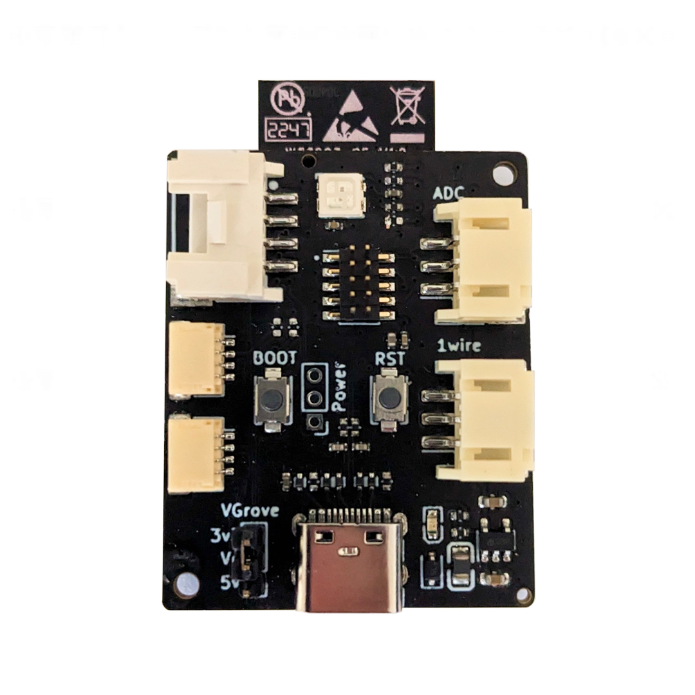
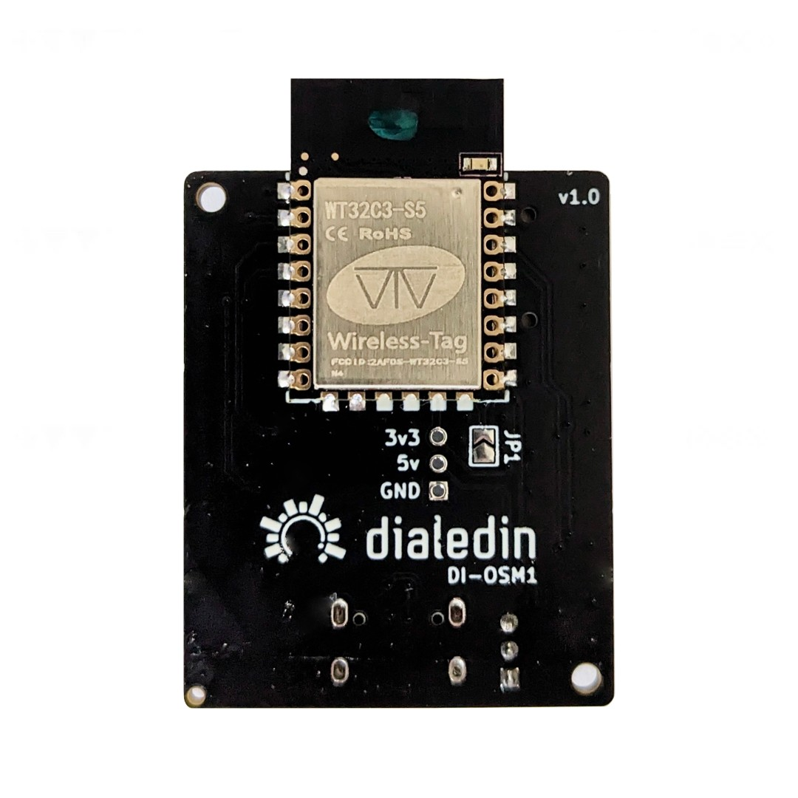
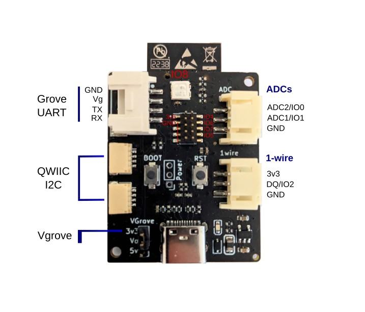

# Dialedin - Open Sense Module (DI-OSM1)

A compact breakout board meticulously crafted to provide the perfect foundation for creating sensor-based modules using open automation platforms like Tasmota, ESPHome or ESPEasy allowing for easy integration with Home Assistant or other smart home platforms. Its compact design ensures stability and reliability, setting it apart from other development kits on the market.

    
    

## Features

- Compatible with most SMD-22 and SMD-16 ESP modules
- 2x QWIIC/StemmaQT I2C connectors
- Grove UART connector (selectable voltage 3v3 or 5v)
- 1-wire connector (for sensors such as DS18B20 probes)
- 2x ADC inputs setup for resistive sensors such as thermistors, LDRs or [eTape](https://milonetech.com/products/standard-etape-assembly)
- on-board WS2812B RGB LED
- 1x User Programmable Button
- 1x Reset Button
- USB Programming and Debug
- 1.27mm pin header with 4x GPIO (JTAG support on compatible modules)

    

|  Function  | Connector | IO (ESP32-C3) | IO (ESP8266) |
|------------|-----------|:-------------:|:------------:|
| U0RX |	Grove |	GPIO20, RX | GPIO3, RX
| U0TX |	Grove | GPIO21, TX | GPIO1, TX
| SDA |	Qwiic |	GPIO3 | GPIO5
| SCL |	Qwiic |	GPIO10 | GPIO4
| DQ |	1-wire |	GPIO2 | GPIO16
| ADC2 | eTape	| GPIO0 | N/A, RST
| ADC1	| eTape	| GPIO1 | GPIO17, ADC
| LED |	RGB	 | GPIO8 | GPIO2
| Boot Button |	Button |	GPIO9 | GPIO0

## Software

If you purchased this board with the `WT32C3-S5` included, it will come with a custom build of [Tasmota](Tasmota/README.md) installed. This has been preconfigured based on above table, ready for most sensors, includes support for mini OLED displays such as SSD1306/SSH1106 and also includes Matter support. Matter support allows this device to integrate directly with Amazon, Apple or Google Home systems without the need for Home Assistant (not all sensors will be supported in this configuration though).

Details for Tasmota support including templates and firmware builds are in this [Folder](Tasmota)  
Example configuration for ESPHome [ESPHome.yaml](ESPHome/esphome.WT32C3.yaml)

In addition to Tasmota there are plenty of other platforms that will work great with this module. There is something for everyone here from writing custom code to configuration with a fully GUI controlled setup.
* [Arduino IDE & Sketches](https://docs.arduino.cc/software/ide-v2)
* [PlatformIO](https://platformio.org/)
* [ESP-IDF](https://docs.espressif.com/projects/esp-idf/en/latest/esp32/get-started/)
* [ESPHome](https://esphome.io/index.html)
* [ESPEasy](https://espeasy.readthedocs.io/en/latest/)
* [Tasmota](https://tasmota.github.io/docs/)
* [WLED](https://kno.wled.ge/)

## Compatible Modules
The following modules are compatible with this board. Not all features supported on ESP8266 modules. Some modules require some additional soldering (see [datasheet](OpenSense_datasheet_v1.0.1.pdf)).

Modules can easily be placed by hand soldering.

* WT32C3-S5 [ESP32-C3]
* ESP8585-WROOM-01 [ESP32-C3]
* ESP-12E, ESP-12F, WT8266-S5 [ESP8266] [^1]
* ESP-07(S), ESP-12S, WT8266-S6 [ESP8266]
* ESP8684-WROOM-01 [ESP32-C2] (requires esp-idf v5.1, not supported by other platforms yet)
* ESP-12H [ESP32-S2]
* ESP-C3-12F [ESP32-C3] (Not recommended) 

[^1]: These modules require removing 2 resistors and applying a solder bridge on JP1, see [datasheet](OpenSense_datasheet_v1.0.1.pdf) for details.