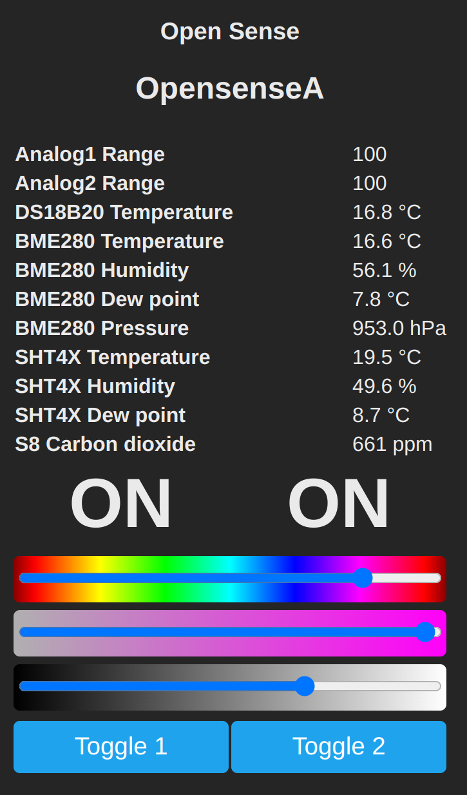

# Tasmota

<p align="center">
    
</p>

### Templates

Template for ESP32-C3
```JSON
{"NAME":"Open Sense","GPIO":[4865,4864,1312,640,1,1,1,1,1376,32,608,0,0,0,0,0,0,0,0,0,1,1],"FLAG":0,"BASE":1}
```

Template for ESP8266
```JSON
{"NAME":"Open Sense","GPIO":[32,1,1376,1,608,640,0,0,1,1,1,1,1312,4864],"FLAG":0,"BASE":18}
```
### MQTT

MQTT must be configured to point to your MQTT broker, so that Home Assistant or your choosen automation platform can discover the device.

### Tasmota Settings

`Teleperiod` controls how often Tasmota will send MQTT messages with sensor updates.Default interval is 300 seconds but can be set between 10 and 3600, you can adjust in Tasmota console to send updates more often

```python
TelePeriod 30
```

`TempRes` controls the resolution (number of decimal places) of temperature values for all sensors connected to Tasmota. The default `TempRes` is `1` which we recommend for most sensors, however if you require more precision you can adjust in console.

```python
TempRes 2
```

`ADC` need to be [range calibrated](https://tasmota.github.io/docs/ADC/#commands), for example 5" eTape: [not tested]
```python
AdcParam1 6 300 663 125  25
```

### Matter
Matter support in Tasmota is currently at experimental status. It will allow you to use your device directly with Alexa/Google Home/HomeKit without requiring Home Assistant.

Matter support is included starting with Tasmota v13.0, but will be disabled by default. You can enable Matter from the web UI or in the console with

```python
SetOption151 1
```


### Custom Firmware Build (ESP32-C3)
You can find our Tasmota32 firmware builds for the ESP32-C3 in this [folder](firmware).

To flash a new device you must use the factory.bin file and flash over serial
```
esptool.py --port /dev/ttyACM0 write_flash 0x0 tasmota32c3cdc-opensense.13.0.factory.bin
```

To upgrade from the Web UI use the `tasmota32c3cdc-opensense.13.0.bin`

[Firmware details](Firmware.md)