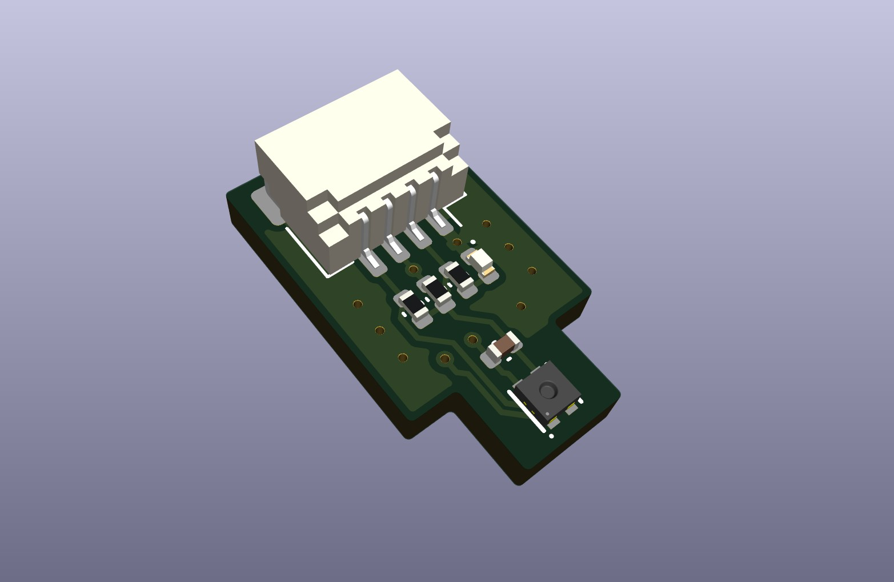
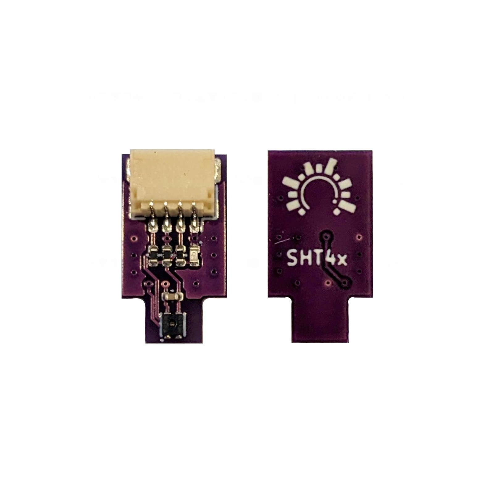

# Dialedin - SHT40 Temperature Sensor (SHT4x)
A uniquely compact and high precision temperature and humidity sensor, built around the advanced technology of Sensirion's SHT40 temperature and humidity sensor. This sensor offers seamless integration through direct plug-and-play compatibility with StemmaQT or QWIIC I2C setups. Boasting an impressive 16-bit resolution, it ensures exceptional accuracy, generating readings with a remarkable 0.2°C precision.

     
    

This is the 4th generation of the well regarded SHT sensors from Sensirion. The SHT4x builds on a completely new and optimised CMOSens® chip that offers reduced power consumption and improved accuracy specifications. Other improvements over the SHT3x series include a new compact package and an internal heater that will improve the accuracy and performance when operating in humid environments. It offers excellent accuracy of ±0.2°C for temperature and ±1.8% relative humidity (from 20% to 80% RH). 

Compatible with all popular embedded platforms such as Arduino, ESPHome, Tasmota and more. Will also happily integrate with any other microcontroller supporting I2C communication, making it an ideal choice for a wide range of applications.

### Features
* Compact design with StemmaQT / QWIIC Connector
* I2C Communications (Address 0x44)
* Power indicator LED
* Fast response times, 16-bit resolution
* Excellent accuracy of ±0.2°C temperature and ±1.8% relative humidity (from 20% to 80% RH)
* Individual calibration and serial number
* Internal heater for high-humidity environments (max 10% duty cycle)

### Specifications

* Sensor: SHT40-AD1B
* I2C Addr: 0x44
* Connector: StemmaQT / QWIIC
* Supply Voltage: 3.0V - 3.6V
* Temperature Range: -40°C to 125°C
* Temperature Accuracy: ±0.2°C (Typical)
* Humidity Range: 0% to 100% RH (Relative Humidity)
* Humidity Accuracy: ±1.8% RH (Typical) in the 20% to 80% RH range
* Dimensions: 8mm x 14.5mm x 5mm

### Links
[SHT40 Datasheet](https://sensirion.com/media/documents/33FD6951/63E1087C/Datasheet_SHT4x_1.pdf)  
[ESPEasy Plugin](https://espeasy.readthedocs.io/en/latest/Plugin/P153.html)   
[ESPHome Component](https://esphome.io/components/sensor/sht4x.html)